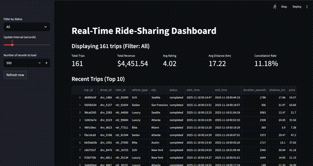

# IDS706 Week 12: Real-Time Streaming System with Apache Kafka

This project demonstrates a real-time streaming pipeline for synthetic ride-sharing trip events:
- **Producer**: generates synthetic trips and publishes them to Kafka (`trips` topic)
- **Kafka**: message broker
- **Consumer**: subscribes to Kafka, writes trips to PostgreSQL
- **PostgreSQL**: persisting all trips
- **Streamlit Dashboard**: live visualization auto-refreshing every few seconds

---

## Project Structure

kafka_realtime_pipeline/

├── docker-compose.yml

├── requirements.txt

├── producer.py

├── consumer.py

├── dashboard.py

├── IDS706_Week12_Screen_Recording.gif

└── README.md

## Requirements

- Docker & Docker Compose
- Python 3.9+

## Video of Working Dashboard



Install Python dependencies:
```bash
pip install -r requirements.txt
